# 本資料について

本資料は 2023/06/24 時点のバージョンを元に作成しています。 
今後のアップデートによっては、不要な操作、使用不可能な操作が出てくることがあります。 
予めご了承ください。

# 事前環境の構築

以下のサイトをご確認いただき、最新環境を作成してください。

[最新環境の作り方](https://github.com/rnakamuramartiny/HowToM365-PPFDevelopEnvironment/blob/main/3_%E6%9C%80%E6%96%B0%E7%92%B0%E5%A2%83%E3%81%AE%E4%BD%9C%E3%82%8A%E6%96%B9/README.md)

# Power Apps の設定

1. 環境を クリックします。

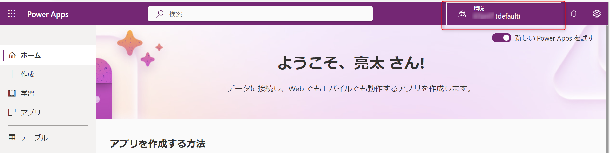

2. 米国リージョンの環境をクリックします。

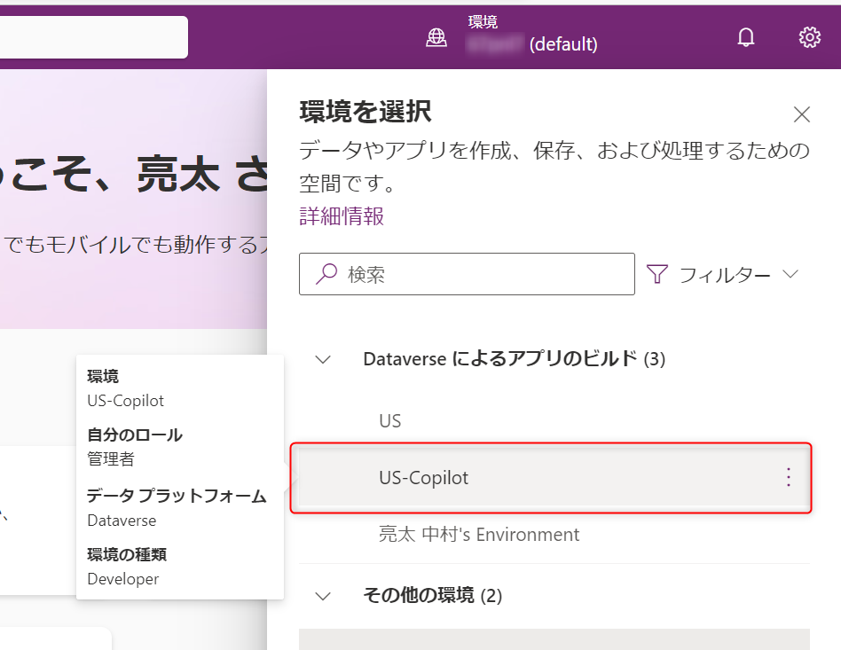

3. 米国リージョンの環境に変わったことを確認します。

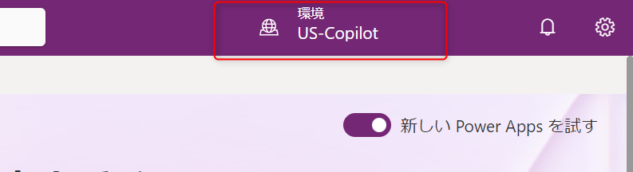

4. 設定ボタンをクリックします。

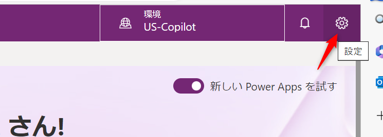

5. Power Apps の設定をクリックします。

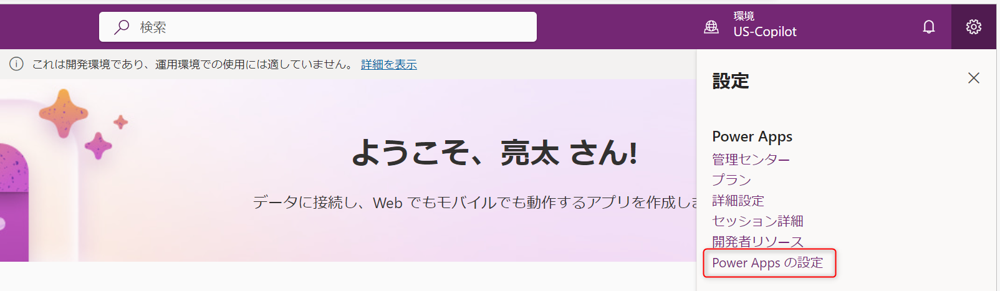

6. 言語設定を 「English」 に変更し、「保存して更新する」をクリックします。

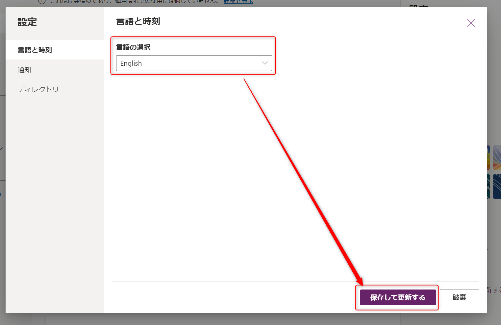

7. Power Apps の Home画面が英語になり、Copilot の入力画面が表示されることを確認します。

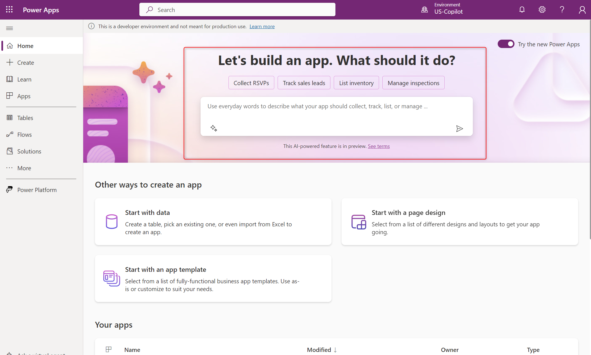

# Power Automate の設定

1. 環境をクリックします。

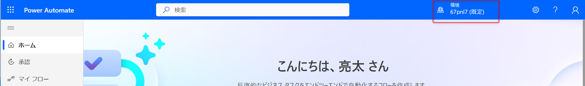

2. プレビュー環境の環境をクリックします。

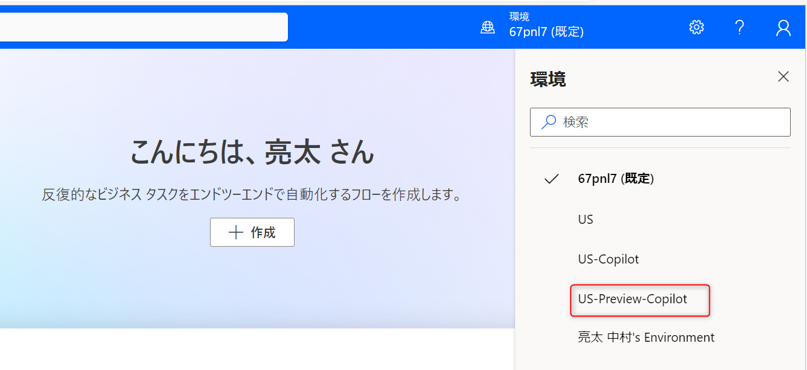

3. プレビュー環境に切り替わったことを確認します。

4. 「設定」をクリックします。

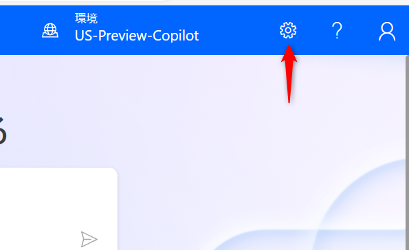

5. 「すべての Power Automate 設定を表示する」をクリックします。

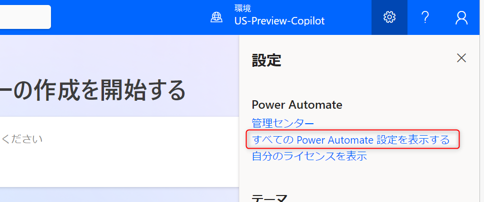

6. 表示言語を English に変更し、実験的な機能を オン にします。

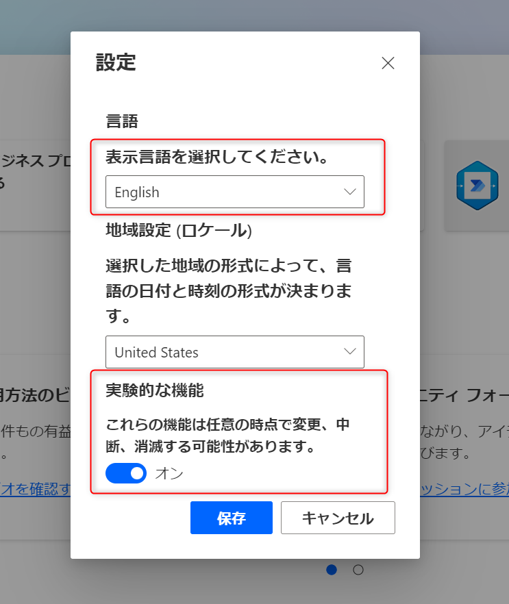

7. 「保存」をクリックします。

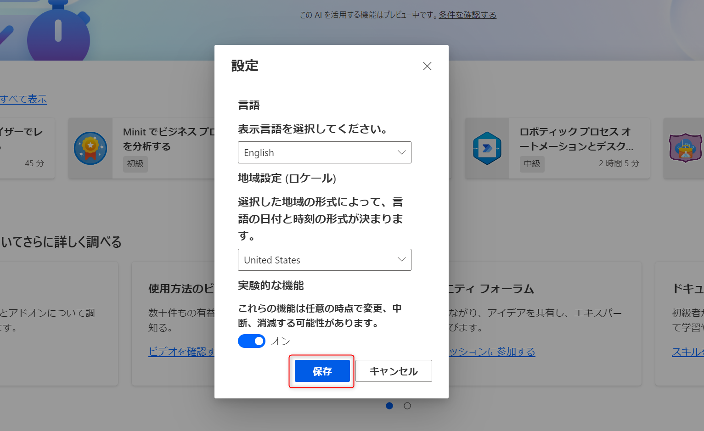

8. Copilot 画面が表示されることを確認します。

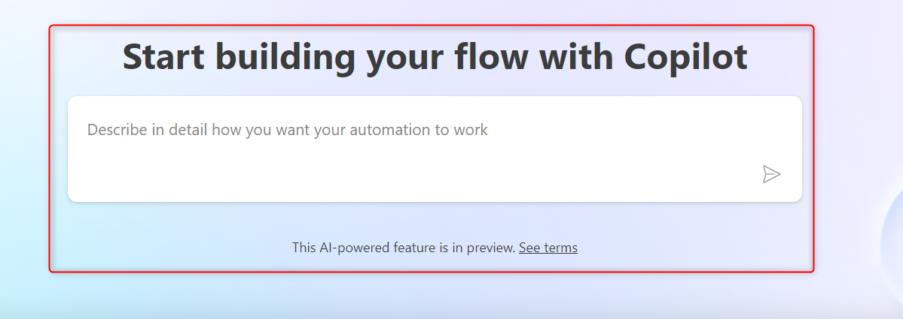