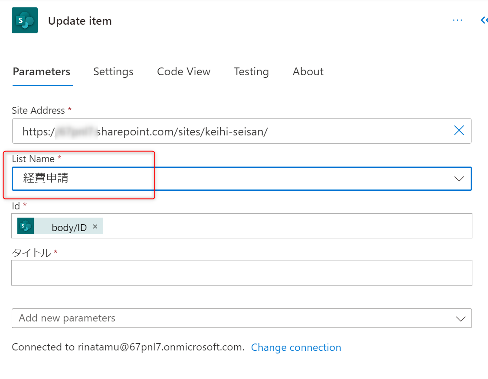

# Power Automate

## 1. 日報アプリの作成

## 1. SharePoint List の作成

トリガー実行用のSharePoint List を作成します。

### 1-1. サイトの作成

1. SharePoint にアクセスします。


2. サイトの作成をクリックします。


3. チームサイトをクリックします。


4. サイト名を「経費精算サイト」とします。


5. グループメールアドレスを以下のようにします。

```
keihi-seisan
```


6. 言語の選択を、日本語に変更して、「次へ」をクリックします。


7. しばらく待って、「完了」をクリックします。


8. サイトが作成されます。


### 1-2. リストの作成

1. サイトコンテンツをクリックします。


2. 新規から、リストをクリックします。


3. 空白のリストをクリックします。


4. 以下の名前を設定して、「作成」をクリックします。

```
経費申請
```


5. 列の追加から、選択肢をクリックし、次へをクリックします。


6. 以下の図のように設定し、「保存」をクリックします。


7. 列の追加から、通貨をクリックし、次へをクリックします。


8. 以下の図のように設定し、「保存」をクリックします。


## 2. Power Automate 作成

### 2-1. Power Automate フロー作成依頼

1. Power Automate の Home 画面の Copilot 入力画面を表示します。


2. 入力画面に以下を入力して、送信ボタンを押してみます。

```
create a new item to sharepoint list and approval.
```


3. 質問内容を読み取り、作成予定のフローが表示されます。「Next」をクリックします。


4. 接続情報の確認画面が表示されます。「Next」をクリックします。


5. 各項目を可能な限りそれぞれ埋めていきます。


6. Create flow をクリックします。


7. フローが作成されます。


### 2-2. Copilot 操作

1. Copilot 画面で以下のように支持します。

```
add SharePoint Update Item to after the Condition False.
```

2. Condition False の後続に、SharePoint の Update Item アクションが追加されることを確認します。


3. Copilot 画面で以下のように支持します。

```
Change Action "Send an Email" to Teams post messege.
```

4. Outlook のメール送信アクションが、Teams のメッセージ送信アクションに変わったことを確認します。


5. Copilot 画面で以下のように支持します。

```
Set Parameter SharePoint Update Item Action's Site Address to "作成したサイトのURL".
```

6. SharePoint の Update Item の Site Address が指定したパラメータになっていることを確認します。


7. Copilot 画面で以下のように支持します。

```
Set Parameter SharePoint Update Item Action's List Name to "経費申請".
```

8. Update Item の List Name が "経費申請" となっていることを確認します。


