# Excel ファイルからアプリ作成

## 1. Excel ファイルのダウンロード

以下のリンクから、Excelファイルをダウンロードします。

[Product Issue.xlsx](./Product%20Issue.xlsx)

## 2. Excel ファイルの読み込みとテーブル作成

1. Power Apps を開き、Home画面の Start with data をクリックします。

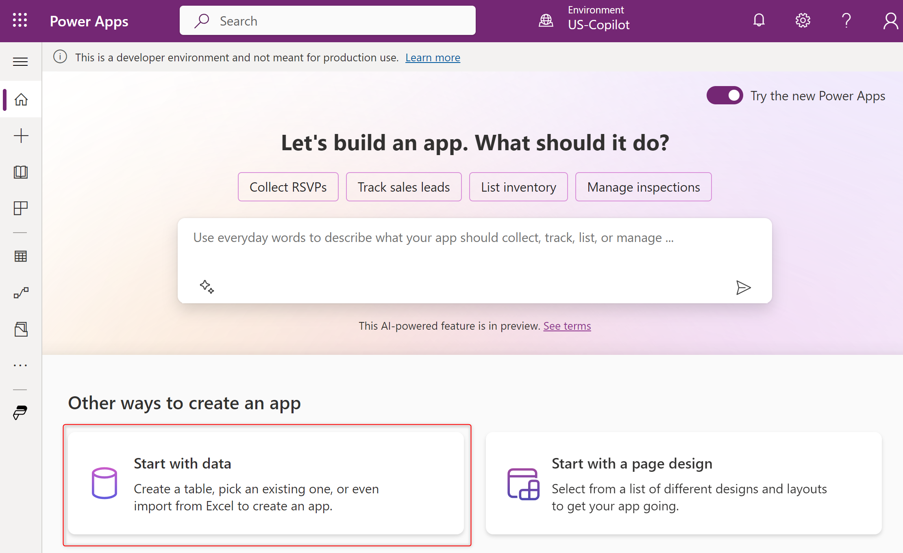

2. Upload an Excel file をクリックします。

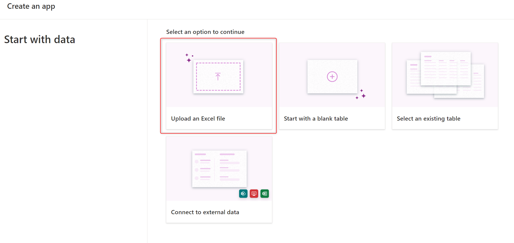

3. Select from device をクリックし、ダウンロードした Excel ファイルを指定します。

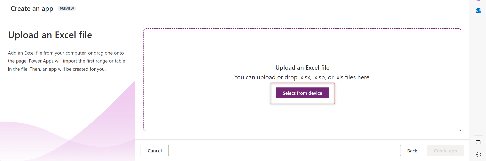

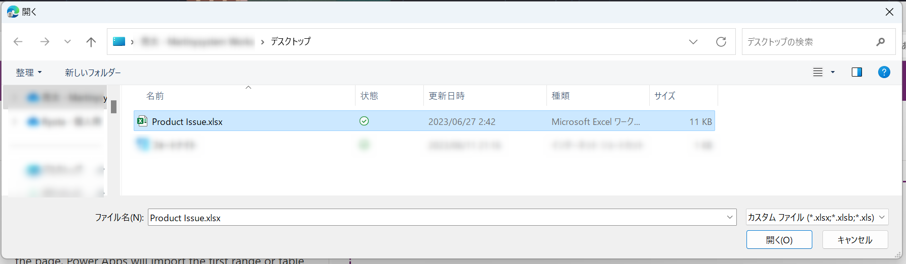

4. Excel の内容に基づき、作成予定のテーブルが表示されます。

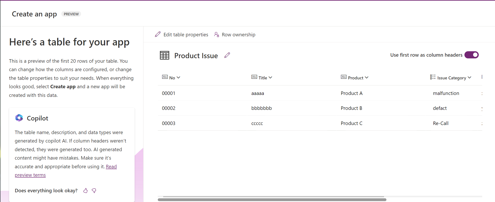

5. 右下の「Create app」をクリックします。

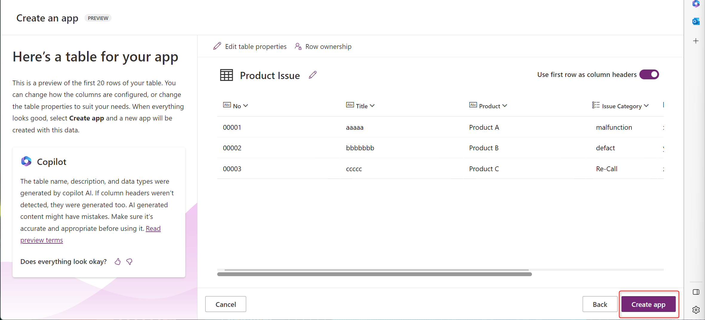

6. しばらくするとアプリが作られます。

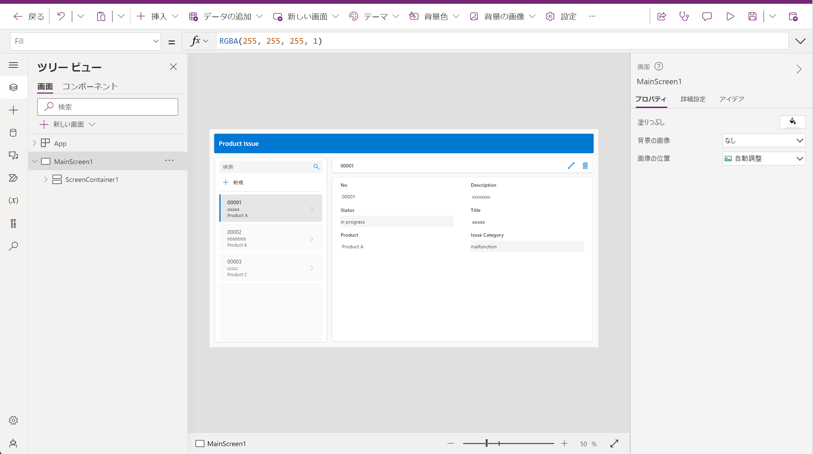

## 3. ID 列を オートナンバー（自動採番）に変更する

1. 左ペインの、「データ」をクリックします。

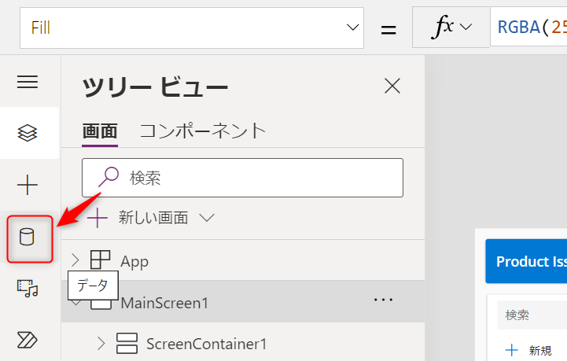

2. Product Issue のメニューから、「データの編集」をクリックします。

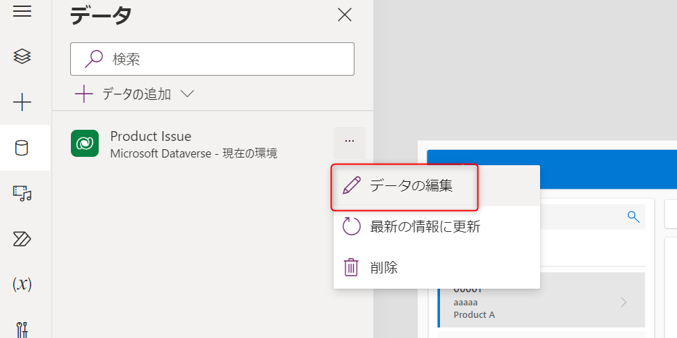

3. No 列のメニューから、「Edit Column」 をクリックします。

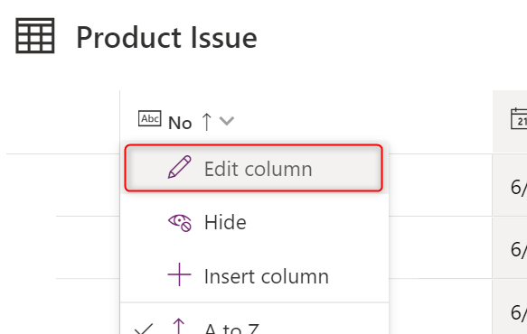

4. Data type をクリックし、「Autonumber」 に変更します。

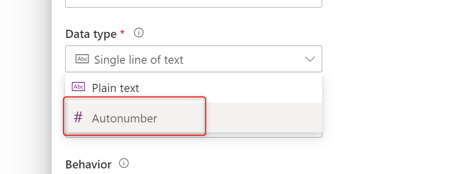

5. 採番ルールの設定が表示されるので、以下のように設定します。

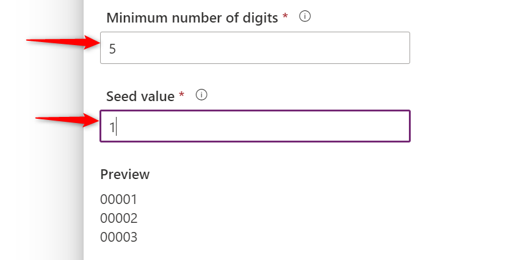

6. 「Save」 をクリックします。

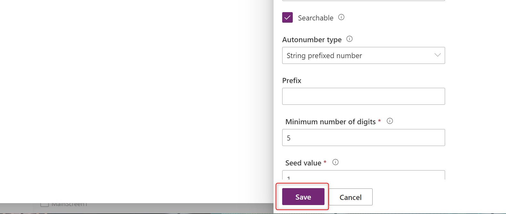

